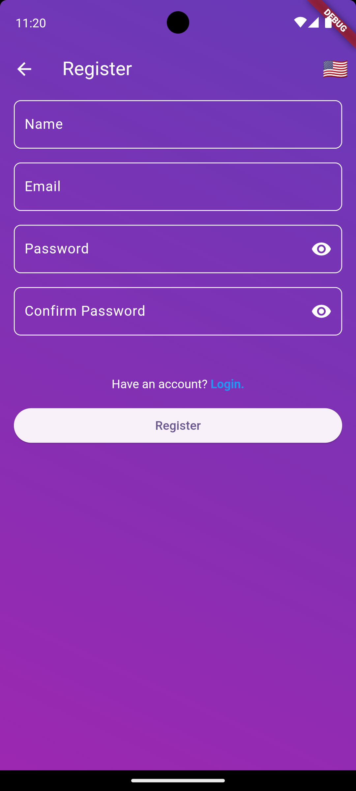

    <h1>D'story</h1>
    
An Flutter app cloning like instagram.

---

  
  
  
  
  
  

## Features
- Login
- Register
- Home
- Detail Story
- Add Story
- Change Language

## Tech Stack & Library
- [injectable](https://pub.dev/packages/injectable) for Dependency Injection.
- [Bloc](https://pub.dev/packages/bloc) for BLoC Design Pattern (Business Logic Component).
- [Retrofit](https://pub.dev/packages/retrofit) for HTTP Client.
- [dart_mappable](https://pub.dev/packages/dart_mappable) for creating models.
- [logger](https://pub.dev/packages/logger) for A logger.
- [easy_localization](https://pub.dev/packages/easy_localization) for Localization.
- [google_maps](https://pub.dev/packages/google_maps_flutter) for provides a Google Maps widget.
- Used AndroidX, Jetpack Compose, Material Design Components 3, and any more libraries.

## Data Source
D'story using the [Dicoding Story API](https://story-api.dicoding.dev/v1) for constructing RESTful API. 
Dicoding Story API provides a RESTful API interface to highly detailed objects built from thousands of lines of data related to stories.